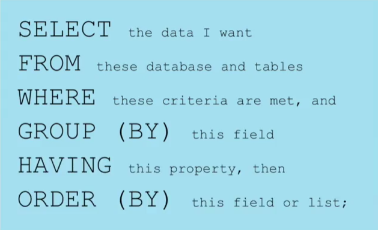
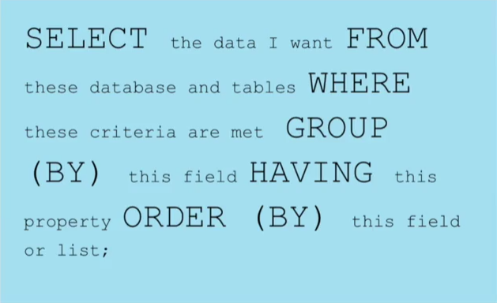
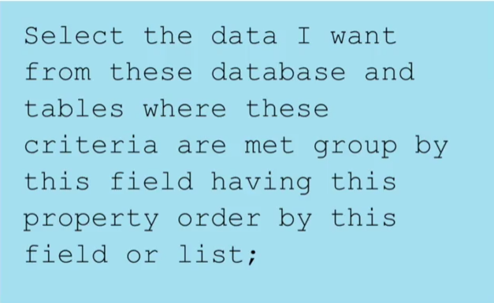
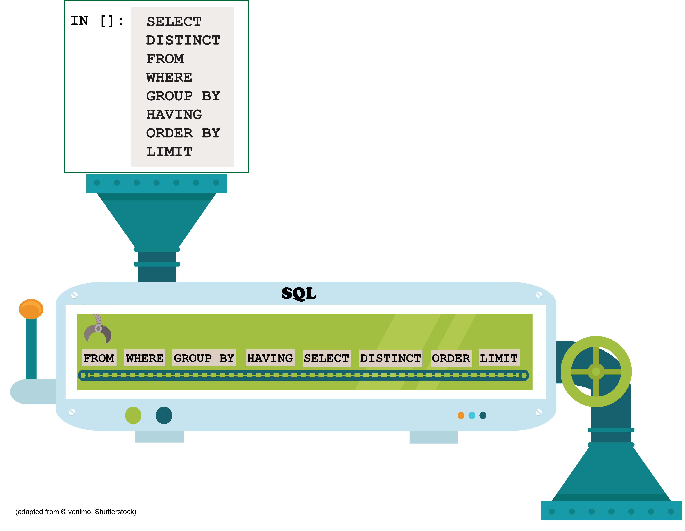
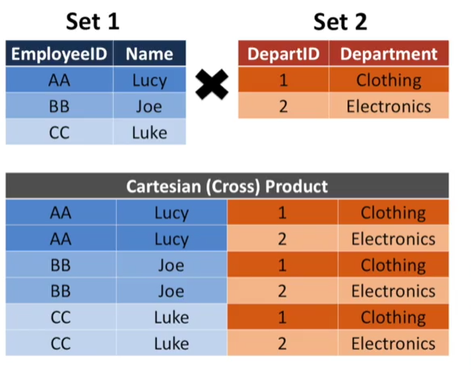
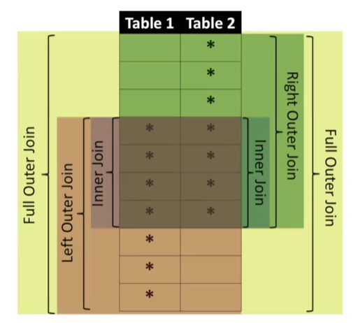

# Managing Big Data with MySQL

**Note**  
More Notebooks will be uploaed in the comming week

This repository stores the exercise notebooks of the Coursera course [Managing Big Data with MySQL](https://www.coursera.org/learn/analytics-mysql).

Exercise Jupyter Notebooks can be viewed using [nbviewer](http://nbviewer.jupyter.org/)

* [Exercise 1: Looking at Your Data](http://nbviewer.jupyter.org/github/XIEQ/MySQL/blob/master/MySQL_Exercise_01_Looking_at_Your_Data.ipynb)
* [Exercise 2: Selecting Data Subsets using WHERE](http://nbviewer.jupyter.org/github/XIEQ/MySQL/blob/master/MySQL_Exercise_02_Selecting_Data_Subsets_using_WHERE.ipynb)
* [Exercise 3: Formatting Selected Data](http://nbviewer.jupyter.org/github/XIEQ/MySQL/blob/master/MySQL_Exercise_03_Formatting_Selected_Data.ipynb)
* [Exercise 4: Summarizing Your Data](http://nbviewer.jupyter.org/github/XIEQ/MySQL/blob/master/MySQL_Exercise_04_Summarizing_Your_Data.ipynb)
* [Exercise 5: Summaries of Groups of Data](http://nbviewer.jupyter.org/github/XIEQ/MySQL/blob/master/MySQL_Exercise_05_Summaries_of_Groups_of_Data.ipynb)
* [Exercise 6: Common Pitfalls of Gourped Data](http://nbviewer.jupyter.org/github/XIEQ/MySQL/blob/master/MySQL_Exercise_06_Common_Pitfalls_of_Grouped_Queries.ipynb)

## Querying Single Table
The course teaches the basics of MySQL queries in business analytics. The key concepts of querying a single table is summarized by the following diagrams

### The Acutal Excution Order of a SQL Query
Note that the actual excuation order of SQL queries is different with the order we write them. The following diagram shows the the difference. 

## Query Multiple Tables

### Cartesian Product

### Joins: inner, lefter outer, right outer, and full outer

